# Temperature Distillation Experiment Results

This summary is based on the run transcript in
[`job.holygpu8a19305.10016326.err`](job.holygpu8a19305.10016326.err), with the
end-of-run stdout summary in
[`job.holygpu8a19305.10016326.out`](job.holygpu8a19305.10016326.out). The final
artifacts are under [`runs/`](runs/) and [`plots/`](plots/).

## Run Provenance

- Batch wrapper: [`gpu_job.sbatch`](gpu_job.sbatch).
- Run time stamp from stdout: May 4, 2026, 21:07:11 EDT.
- Runtime environment: site Python module `python/3.12.5-fasrc01`, scratch
  environment `/n/pehlevan_lab/Users/sab/.conda/envs/scratch`, CUDA-visible
  PyTorch reported in the transcript as `torch 2.11.0+cu128`.
- Teacher/data: `EleutherAI/pythia-70m-deduped` on streaming `allenai/c4`, config
  `en`, split `train`.
- Student: 8 layers, width 512, 8 heads, muP base width 256, dropout 0.
- Training: seed 17, 2,000 steps, eval every 100 steps, batch size 16, sequence
  length 128, bf16, compiled model, gradient clipping 1.0.
- Sweep grid: XENT distillation for betas `0.5`, `1`, `4`, `10`, `100`, `inf`
  across `adamw`, `sgd`, and `muon`, plus one MSE beta-1 control per optimizer.
- Implementation note: `beta=inf` uses hard next-token cross-entropy in
  `distill_loss` and `scalar_metrics`, not teacher-argmax hard-label
  distillation. The teacher-target kernel diagnostic for `beta=inf` still uses
  teacher argmax labels.
- Diagnostic probes: NTK-style probe batch size 8, kernel diagnostics every 200
  steps over `blocks.(6|7)|ln_f|lm_head`.

The first smoke test reached training but failed in the kernel-overlap
diagnostic because one kernel tensor was on CPU and the teacher-target kernel was
on CUDA. The transcript records a small fix in
[`src/tempdistill/metrics.py`](src/tempdistill/metrics.py): the overlap helper
now colocates tensors before multiplying them. After that, the smoke test passed,
the full sweep completed, and plots were regenerated.

One cleanup was performed before the final plots: the first AdamW sweep already
included the MSE control, so the explicit AdamW MSE command appended a duplicate
segment to `runs/mse_beta-1_adamw_seed17/metrics.jsonl`. That file was pruned
back to one complete segment and plots were regenerated. The final aggregate
therefore represents 21 unique runs.

## Main Result

Moderate finite inverse-temperatures were best overall. For AdamW, beta 10 had
the best final distillation loss and true-next-token accuracy, while beta 1 had
the best final teacher-argmax accuracy. Muon was competitive but less clearly
better than AdamW. SGD barely learned under this configuration.

There is not a clean monotonic sample-complexity improvement as beta increases.
Very soft beta 0.5 can cross low teacher-argmax thresholds early but ends with a
worse distillation loss. Very sharp beta 100 has much larger Fisher trace and
gradient norms and degrades final accuracy, especially for AdamW and SGD. The
useful regime in this run is the middle of the grid: beta 1, 4, and 10.

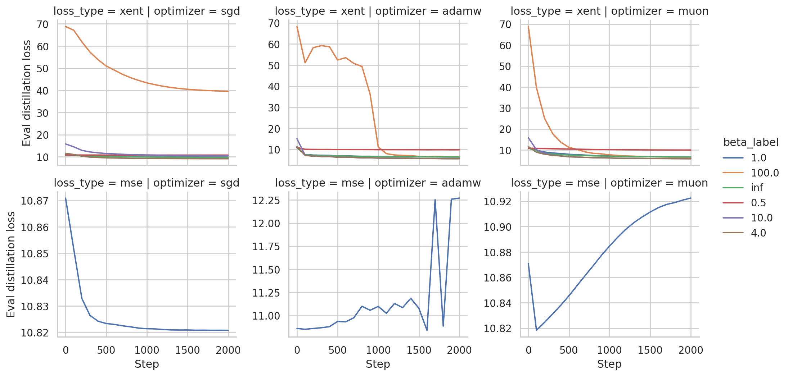

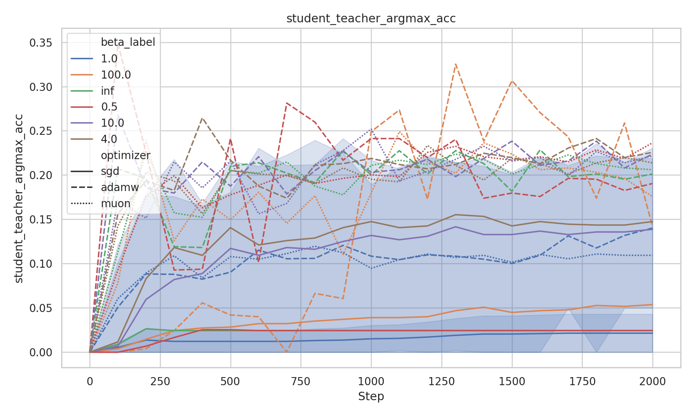

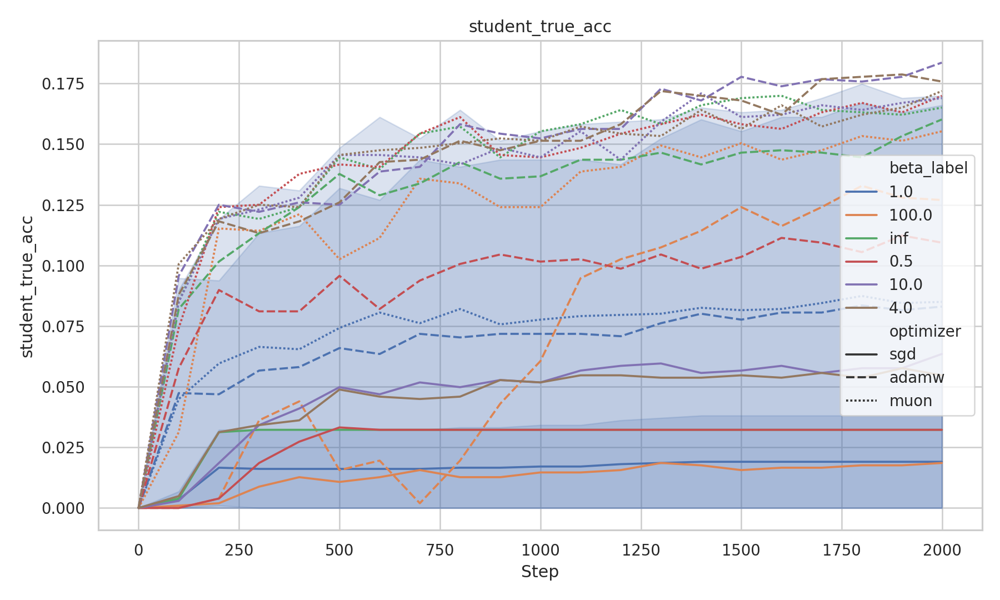

## Best Final XENT Metrics

| optimizer | best final distill loss | best final teacher-argmax acc | best final true-token acc |
| --- | --- | --- | --- |
| adamw | beta 10.0: 5.554 | beta 1.0: 0.2305 | beta 10.0: 0.1836 |
| muon | beta 4.0: 5.820 | beta 0.5: 0.2363 | beta 4.0: 0.1719 |
| sgd | beta 4.0: 9.159 | beta 4.0: 0.1475 | beta 10.0: 0.0635 |

## Final XENT Metrics

Values are the final eval row for each run in
[`plots/all_metrics.csv`](plots/all_metrics.csv).

| optimizer | beta | distill loss | teacher-argmax acc | true acc | hard xent | logit MSE | Fisher trace | eff. support | kernel init overlap | teacher-kernel overlap |
| --- | --- | --- | --- | --- | --- | --- | --- | --- | --- | --- |
| adamw | 0.5 | 9.793 | 0.1904 | 0.1094 | 6.680 | 2.43e6 | 0.2492 | 8133 | 0.9945 | 0.5024 |
| adamw | 1.0 | 6.368 | 0.2305 | 0.1660 | 5.923 | 2.44e6 | 0.8336 | 197.6 | 0.9552 | 0.3667 |
| adamw | 4.0 | 5.583 | 0.2256 | 0.1758 | 8.586 | 2.42e6 | 12.20 | 145.6 | 0.9609 | 0.3596 |
| adamw | 10.0 | 5.554 | 0.2236 | 0.1836 | 9.790 | 2.42e6 | 76.23 | 145.6 | 0.9893 | 0.2969 |
| adamw | 100.0 | 6.543 | 0.1426 | 0.1270 | 10.71 | 2.42e6 | 7623 | 145.6 | 0.9722 | 0.2733 |
| adamw | inf | 6.442 | 0.2012 | 0.1602 | 6.442 | 2.44e6 | 0 | 1.0 | 0.9285 | 0.8305 |
| muon | 0.5 | 9.973 | 0.2363 | 0.1699 | 6.359 | 2.42e6 | 0.2492 | 8133 | 0.9550 | 0.5152 |
| muon | 1.0 | 6.706 | 0.2188 | 0.1699 | 6.197 | 2.42e6 | 0.8336 | 197.6 | 0.9619 | 0.3118 |
| muon | 4.0 | 5.820 | 0.2139 | 0.1719 | 9.030 | 2.42e6 | 12.20 | 145.6 | 0.9868 | 0.3287 |
| muon | 10.0 | 5.827 | 0.2217 | 0.1689 | 10.03 | 2.42e6 | 76.23 | 145.6 | 0.9921 | 0.3151 |
| muon | 100.0 | 6.486 | 0.1758 | 0.1553 | 10.70 | 2.42e6 | 7623 | 145.6 | 0.9746 | 0.2817 |
| muon | inf | 6.706 | 0.2061 | 0.1650 | 6.706 | 2.42e6 | 0 | 1.0 | 0.9766 | 0.9425 |
| sgd | 0.5 | 10.80 | 0.0244 | 0.0322 | 10.42 | 2.42e6 | 0.2492 | 8133 | 0.9828 | 0.4469 |
| sgd | 1.0 | 9.884 | 0.0430 | 0.0381 | 9.664 | 2.42e6 | 0.8336 | 197.6 | 0.9770 | 0.2729 |
| sgd | 4.0 | 9.159 | 0.1475 | 0.0547 | 10.18 | 2.42e6 | 12.20 | 145.6 | 0.9775 | 0.2742 |
| sgd | 10.0 | 10.51 | 0.1387 | 0.0635 | 10.45 | 2.42e6 | 76.23 | 145.6 | 0.9746 | 0.2715 |
| sgd | 100.0 | 39.58 | 0.0537 | 0.0186 | 10.61 | 2.42e6 | 7623 | 145.6 | 0.9728 | 0.2713 |
| sgd | inf | 9.757 | 0.0244 | 0.0322 | 9.757 | 2.42e6 | 0 | 1.0 | 0.9774 | 0.9966 |

## Sample-Complexity Indicators

The table below uses the first eval point that crossed 20% teacher-argmax
accuracy. Approximate tokens are `(step + 1) * batch_size * seq_len`, using
`16 * 128 = 2,048` tokens per training step.

| optimizer | beta | first step | approx tokens | teacher-argmax acc |
| --- | --- | --- | --- | --- |
| adamw | 0.5 | 100 | 206,848 | 0.349 |
| adamw | 1.0 | 600 | 1,230,848 | 0.230 |
| adamw | 4.0 | 400 | 821,248 | 0.265 |
| adamw | 10.0 | 100 | 206,848 | 0.268 |
| adamw | 100.0 | 1000 | 2,050,048 | 0.249 |
| adamw | inf | 100 | 206,848 | 0.207 |
| muon | 0.5 | 700 | 1,435,648 | 0.200 |
| muon | 1.0 | 300 | 616,448 | 0.218 |
| muon | 4.0 | 200 | 411,648 | 0.203 |
| muon | 10.0 | 300 | 616,448 | 0.215 |
| muon | 100.0 | 200 | 411,648 | 0.239 |
| muon | inf | 200 | 411,648 | 0.227 |

No SGD run reached 20% teacher-argmax accuracy. Only two runs reached 30%:
AdamW beta 0.5 at step 100 and AdamW beta 100 at step 1300. Because these are
single eval crossings and beta 0.5 later finishes with worse distillation loss,
the threshold table should be read as a rough sample-complexity indicator, not a
stable ranking by itself.

## Temperature Diagnostics

The teacher distribution changes sharply between beta 0.5 and beta 1. Above
beta 4 the entropy/effective-support summaries are similar in the saved final
AdamW eval row, while the Fisher trace proxy scales strongly with beta. This is
the clearest diagnostic signal explaining why beta 100 is hard: the target
distribution is sharp and the gradient/Fisher proxy is huge.

| beta | teacher entropy | top-1 conf | eff. support | Fisher trace | margin | teacher true acc |
| --- | --- | --- | --- | --- | --- | --- |
| 0.5 | 8.888 | 0.0192 | 8133 | 0.2492 | 1.258 | 0.1357 |
| 1.0 | 4.075 | 0.1956 | 197.6 | 0.8336 | 1.258 | 0.1357 |
| 4.0 | 3.093 | 0.2377 | 145.6 | 12.20 | 1.258 | 0.1357 |
| 10.0 | 3.093 | 0.2377 | 145.6 | 76.23 | 1.258 | 0.1357 |
| 100.0 | 3.093 | 0.2377 | 145.6 | 7623 | 1.258 | 0.1357 |
| inf | 0 | 1.000 | 1.0 | 0 | 1.258 | 0.1357 |

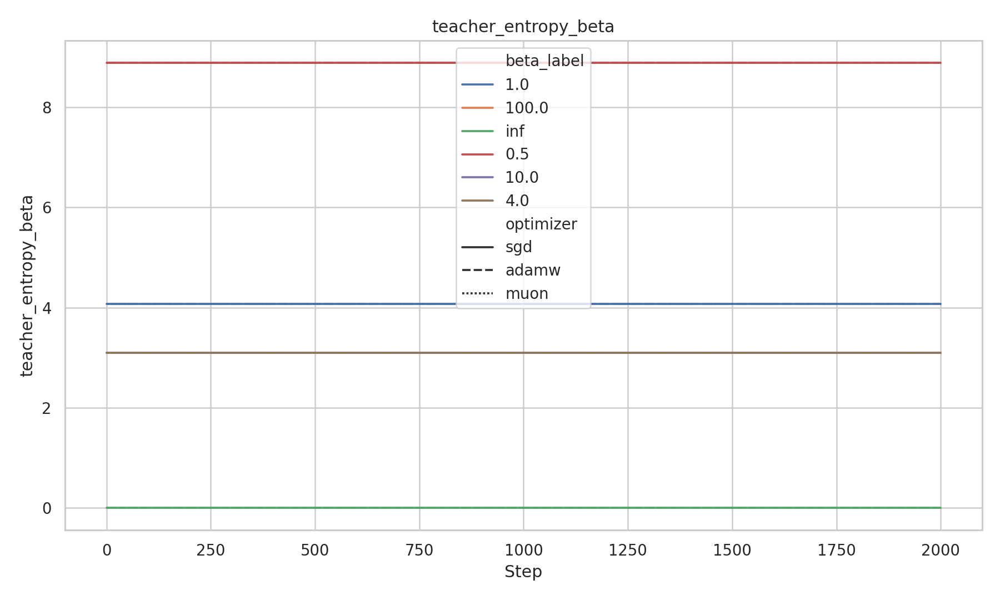

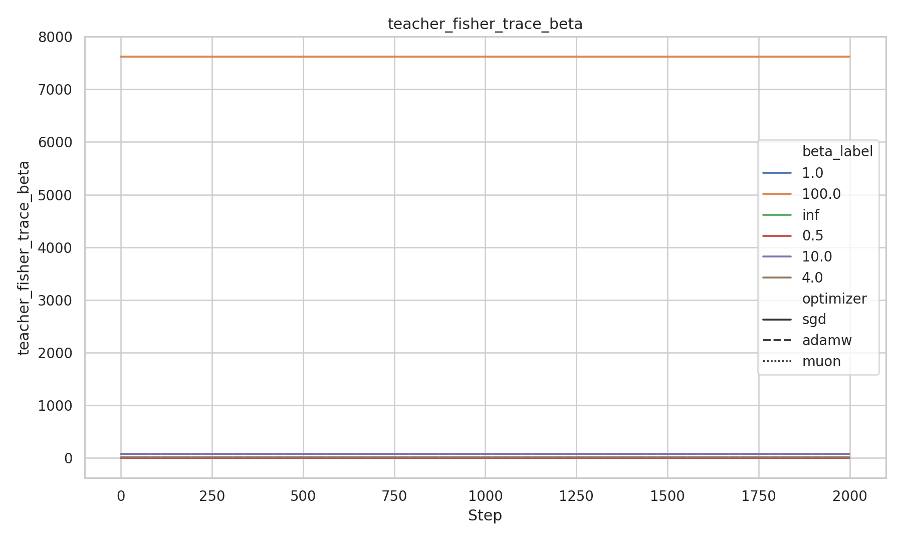

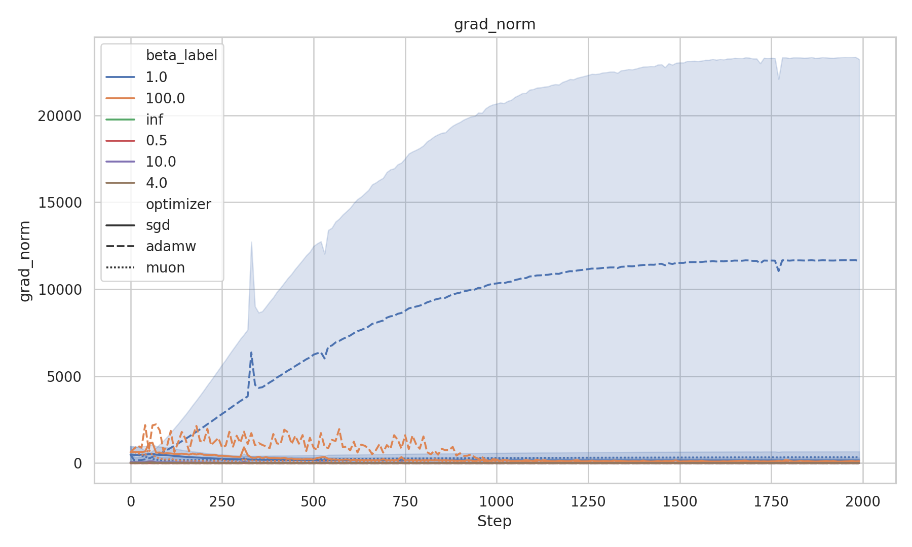

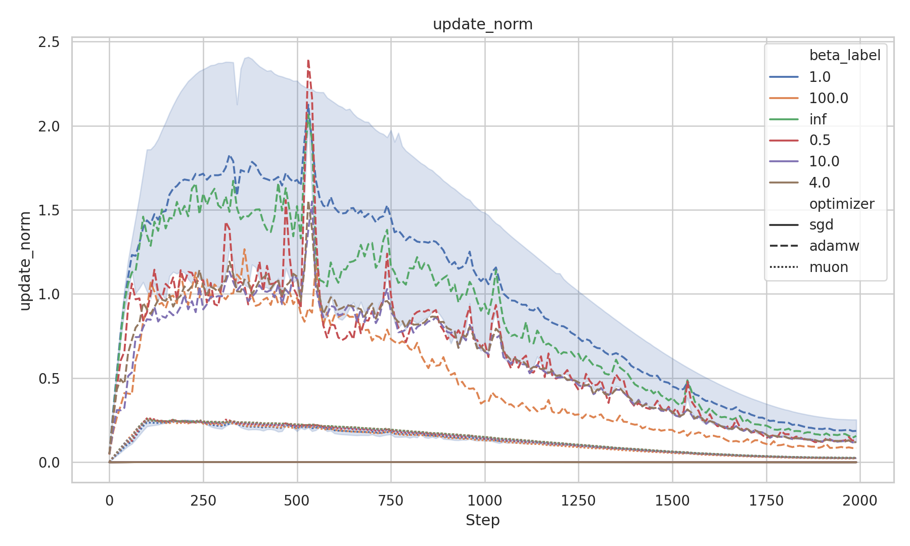

## MSE Controls

The MSE controls did not produce useful distillation behavior. AdamW MSE reduced
logit MSE substantially relative to the XENT runs, but its teacher-argmax and
true-token accuracies collapsed. Muon and SGD MSE did not materially reduce
logit MSE.

| optimizer | distill/eval loss | teacher-argmax acc | true acc | hard xent | logit MSE | kernel init overlap | teacher-kernel overlap |
| --- | --- | --- | --- | --- | --- | --- | --- |
| adamw | 12.27 | 0.0498 | 0 | 12.53 | 9.98e5 | 0.9681 | 0.2711 |
| muon | 10.92 | 0 | 0 | 10.91 | 2.41e6 | 0.9721 | 0.2680 |
| sgd | 10.82 | 0 | 0 | 10.81 | 2.42e6 | 0.9741 | 0.2661 |

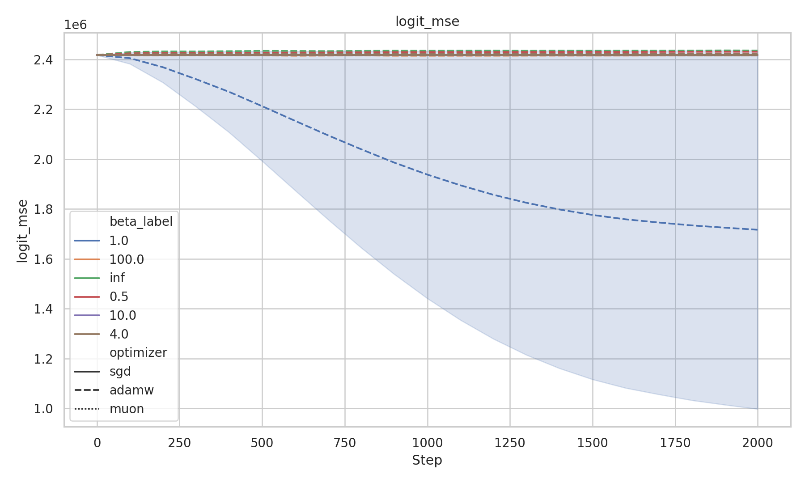

## Kernel Diagnostics

Kernel overlap with initialization stayed high, roughly `0.93` to `0.99` at the
final eval points, suggesting mostly lazy/kernel-like movement over this short
training horizon and probe. Teacher-target kernel overlap was highest for
`beta=inf` and lower for finite sharp beta values. This supports the
interpretation that the student kernel geometry was not substantially reshaped
by the finite-temperature targets during these 2,000-step runs.

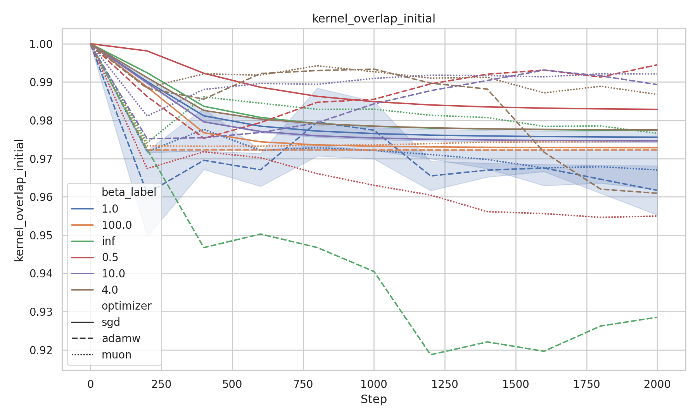

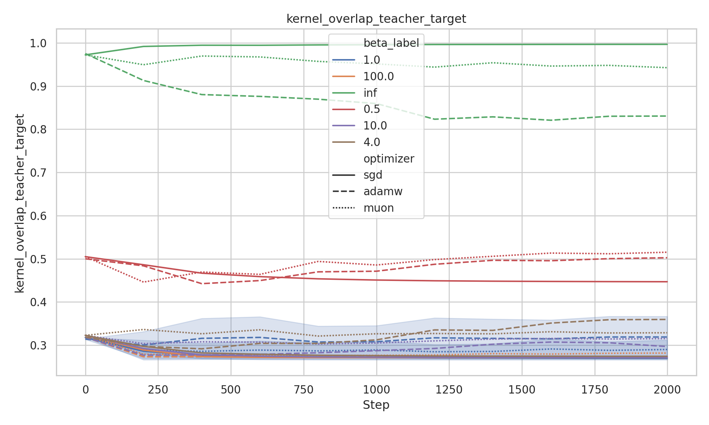

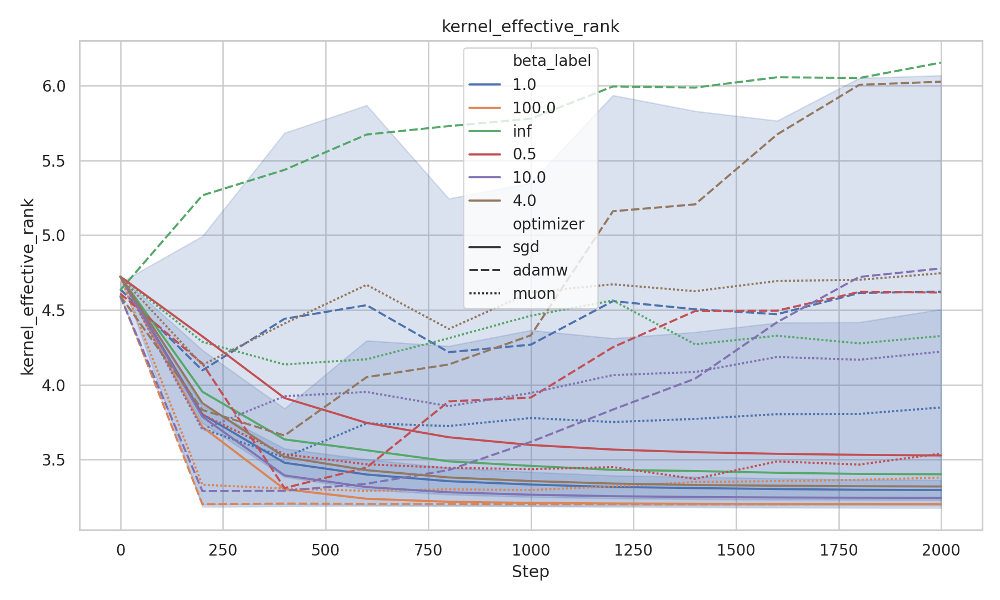

## Artifact Index

- Aggregate metrics: [`plots/all_metrics.csv`](plots/all_metrics.csv), 4,684
  CSV lines.
- Per-run metrics: 21 `metrics.jsonl` files under [`runs/`](runs/), each with
  223 JSONL lines.
- Main plots:
  [`plots/distill_loss_grid.png`](plots/distill_loss_grid.png),
  [`plots/student_teacher_argmax_acc.png`](plots/student_teacher_argmax_acc.png),
  [`plots/student_true_acc.png`](plots/student_true_acc.png),
  [`plots/hard_xent.png`](plots/hard_xent.png),
  [`plots/logit_mse.png`](plots/logit_mse.png).
- Diagnostic plots:
  [`plots/teacher_entropy_beta.png`](plots/teacher_entropy_beta.png),
  [`plots/teacher_fisher_trace_beta.png`](plots/teacher_fisher_trace_beta.png),
  [`plots/ce_grad_signal_norm_beta.png`](plots/ce_grad_signal_norm_beta.png),
  [`plots/grad_norm.png`](plots/grad_norm.png),
  [`plots/update_norm.png`](plots/update_norm.png),
  [`plots/kernel_overlap_initial.png`](plots/kernel_overlap_initial.png),
  [`plots/kernel_overlap_teacher_target.png`](plots/kernel_overlap_teacher_target.png),
  [`plots/kernel_effective_rank.png`](plots/kernel_effective_rank.png),
  [`plots/final_acc_vs_fisher.png`](plots/final_acc_vs_fisher.png).

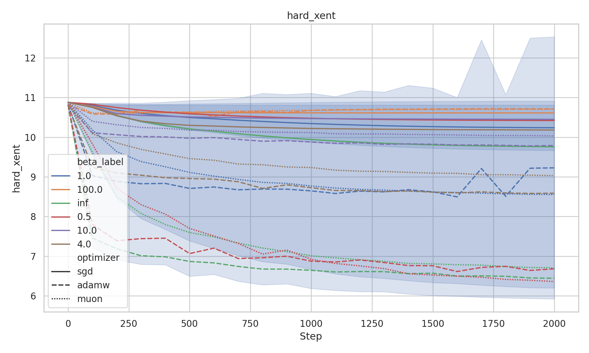

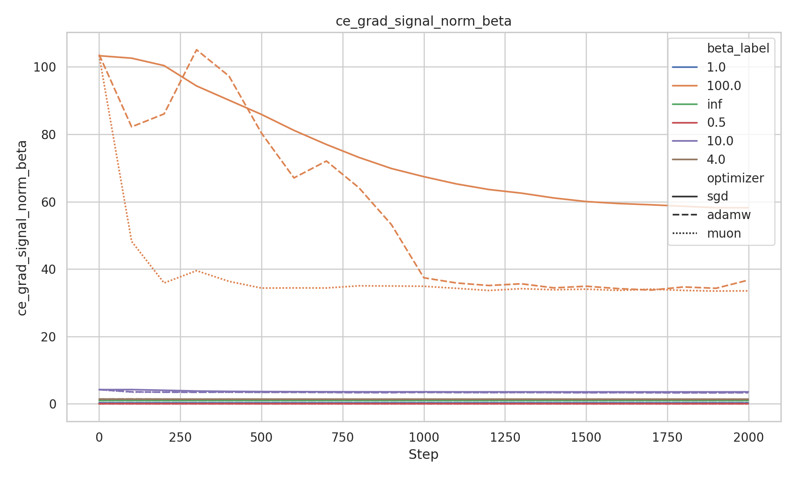

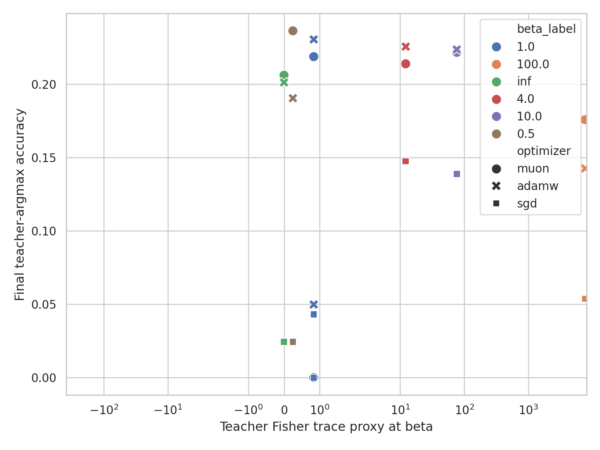

## Follow-Up Fixes From Q1-Q3

The MSE control likely failed because it matched raw logits directly. Raw
teacher logits have an arbitrary per-token additive gauge, and a uniform L2 loss
over the full vocabulary can spend most of its effort fitting common-mode and
tail-logit structure rather than the relative top-logit energy differences that
control the distribution. A better energy-matching control should center logits
per token before applying MSE, or match `log_softmax` energies. Useful variants:
centered logit MSE, `log_softmax` MSE, top-k weighted energy MSE, or
teacher-probability-weighted energy MSE.

The beta-100 versus beta-infinity non-monotonicity should be treated as an
objective-scaling issue. I agree that the intended `beta=inf` condition is the
`beta -> infinity` limit and should be comparable to finite beta. The right
finite-beta prescription is to normalize the beta-temperature cross-entropy by
`1 / beta`, so high beta becomes a margin-like objective rather than an
unbounded beta-scaled loss. The caveat for this particular run is that the
existing `beta=inf` branch used hard true-token cross-entropy, not the
hard-teacher limit. The next sweep should make `beta=inf` the hard-teacher
limit of the same normalized objective.

Future plots should include a fixed-temperature KL diagnostic for every run,
evaluated at `beta_prime = 1` regardless of the training beta:

```python
p = softmax(teacher_logits)
q = softmax(student_logits)
kl_beta_prime_1 = sum_i p_i * (log p_i - log q_i)
```

This gives a common evaluation scale across all training temperatures. The
current logs do not contain per-eval logits or per-eval checkpoints, so the full
fixed-`beta_prime=1` KL curves cannot be reconstructed exactly from the saved
artifacts. The plotting code has been prepared to emit this curve once future
runs log `kl_beta_prime_1`.

The loss curves also indicate that hyperparameters need tuning after the
objective fixes. AdamW and Muon were still improving at the end of many runs, so
2,000 steps is too short for a stable comparison. SGD needs a separate learning
rate and momentum sweep or should be removed from the main comparison. High-beta
runs need beta-aware learning rate or gradient-clipping settings, and MSE-style
energy objectives need their own normalization and optimizer settings rather
than sharing the XENT sweep hyperparameters.
