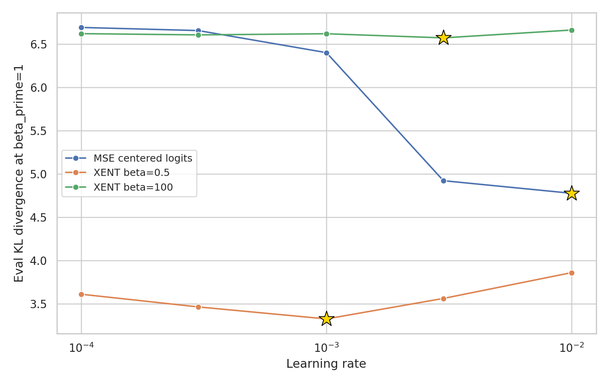
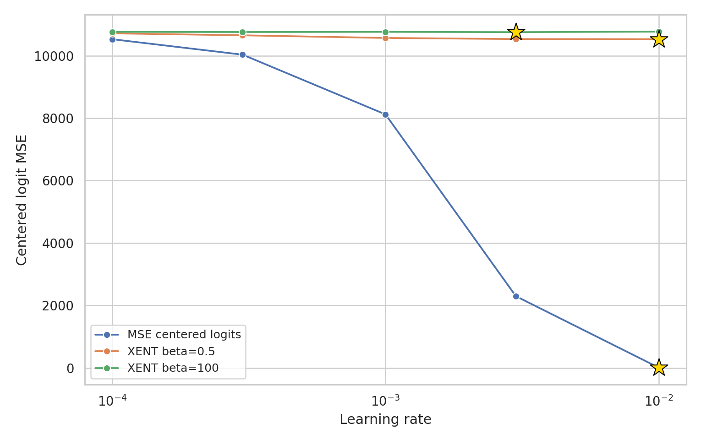

# 500-Step AdamW Learning-Rate Sweep

Created: 2026-05-05

## Methods

This follow-up sweep tests whether the prior beta curves were confounded by using a single learning rate. It keeps the teacher, C4 stream, student architecture, seed, batch size, sequence length, precision, AdamW optimizer family, weight decay, cosine warmup/min-lr schedule, cache settings, and kernel probe settings aligned with `configs/h200_sweep.yaml`, except `max_steps=500`, `eval_every=100`, new output directories, and the swept learning rate.

- Config: `configs/lr_sweep_500step.yaml`
- Runs: `runs_lr_sweep_500step/`
- Plots: `plots_lr_sweep_500step/`
- Learning-rate grid: 1.0000e-04, 3.0000e-04, 0.0010, 0.0030, 0.0100
- Conditions: XENT beta=0.5, XENT beta=100, and centered-logit MSE.
- Endpoint row: latest eval row, expected at train step 499.
- Primary KL metric: `kl_beta_prime_1`.
- Primary logit-MSE metric: `centered_logit_mse`.
- The `0.01` point is the single allowed extra LR per condition. It was added after the initial four-point grid selected the high-LR boundary for at least one primary metric.

## Results Summary

- KL-best learning rates: MSE `0.01`, XENT beta=0.5 `0.001`, XENT beta=100 `0.003`.
- Centered-MSE-best learning rates: MSE `0.01`, XENT beta=0.5 `0.01`, XENT beta=100 `0.003`.
- For XENT beta=0.5, KL worsens from 3.3230 at `lr=0.001` to 3.8577 at `lr=0.01`, while centered logit MSE is nearly flat and slightly favors the larger LR. That is a concrete KL/MSE-best mismatch.
- For XENT beta=100, `lr=0.01` is worse than `lr=0.003` on KL (6.6604 vs 6.5698) and has a larger update norm (0.6151), so `0.003` remains the selected LR despite weak accuracy.
- Centered-logit MSE training is highly LR-sensitive over this range: centered MSE falls from 8119.8027 at `lr=0.001` to 10.9380 at `lr=0.01`. At `lr=0.01`, log-softmax MSE is 29.5211, while raw logit MSE is still 9.2939e+05, consistent with raw logit MSE retaining additive-gauge contamination.

## Eval KL vs LR

## Centered Logit MSE vs LR

## Best Learning Rates

| condition | kl_best_lr | best_kl_beta_prime_1 | mse_best_lr | best_centered_logit_mse |
| --- | --- | --- | --- | --- |
| MSE centered logits | 0.0100 | 4.7743 | 0.0100 | 10.9380 |
| XENT beta=0.5 | 0.0010 | 3.3230 | 0.0100 | 1.0527e+04 |
| XENT beta=100 | 0.0030 | 6.5698 | 0.0030 | 1.0753e+04 |

## Final Endpoint Metrics

Full CSV: `plots_lr_sweep_500step/final_metrics.csv`

| condition | lr | eval_step | kl_beta_prime_1 | centered_logit_mse | logit_mse | log_softmax_mse | distill_eval_loss | student_teacher_argmax_acc | student_true_acc | grad_norm | update_norm |
| --- | --- | --- | --- | --- | --- | --- | --- | --- | --- | --- | --- |
| MSE centered logits | 1.0000e-04 | 499 | 6.6902 | 1.0527e+04 | 2.3960e+06 | 1.0789e+04 | 10.8034 | 0 | 0 | 23.6211 | 0.0258 |
| MSE centered logits | 3.0000e-04 | 499 | 6.6542 | 1.0032e+04 | 2.3499e+06 | 1.0286e+04 | 10.7674 | 0 | 0 | 36.5780 | 0.0767 |
| MSE centered logits | 0.0010 | 499 | 6.3990 | 8119.8027 | 2.1640e+06 | 8344.3047 | 10.5122 | 0 | 0 | 87.4460 | 0.2542 |
| MSE centered logits | 0.0030 | 499 | 4.9199 | 2298.5818 | 1.4648e+06 | 2407.4707 | 9.0331 | 0.3330 | 0.0371 | 128.7586 | 0.7328 |
| MSE centered logits | 0.0100 | 499 | 4.7743 | 10.9380 | 9.2939e+05 | 29.5211 | 8.8874 | 0.3193 | 0.0371 | 1.1040 | 1.0277 |
| XENT beta=0.5 | 1.0000e-04 | 499 | 3.6081 | 1.0715e+04 | 2.4239e+06 | 1.0908e+04 | 20.0598 | 0.2539 | 0.0879 | 0.2939 | 0.0172 |
| XENT beta=0.5 | 3.0000e-04 | 499 | 3.4617 | 1.0651e+04 | 2.4255e+06 | 1.0814e+04 | 19.8385 | 0.1846 | 0.0928 | 0.3489 | 0.0472 |
| XENT beta=0.5 | 0.0010 | 499 | 3.3230 | 1.0567e+04 | 2.4264e+06 | 1.0720e+04 | 19.7576 | 0.1875 | 0.1016 | 0.1516 | 0.1347 |
| XENT beta=0.5 | 0.0030 | 499 | 3.5597 | 1.0532e+04 | 2.4261e+06 | 1.0685e+04 | 19.8604 | 0.1611 | 0.0889 | 0.1704 | 0.3913 |
| XENT beta=0.5 | 0.0100 | 499 | 3.8577 | 1.0527e+04 | 2.4265e+06 | 1.0683e+04 | 19.9889 | 0.2324 | 0.0762 | 0.3202 | 1.1006 |
| XENT beta=100 | 1.0000e-04 | 499 | 6.6185 | 1.0761e+04 | 2.4161e+06 | 1.1030e+04 | 0.0728 | 0.2568 | 0.1201 | 0.6738 | 0.0100 |
| XENT beta=100 | 3.0000e-04 | 499 | 6.6042 | 1.0757e+04 | 2.4152e+06 | 1.1025e+04 | 0.0685 | 0.2725 | 0.1318 | 0.5859 | 0.0306 |
| XENT beta=100 | 0.0010 | 499 | 6.6174 | 1.0762e+04 | 2.4162e+06 | 1.1031e+04 | 0.0756 | 0.2764 | 0.0928 | 0.7325 | 0.0751 |
| XENT beta=100 | 0.0030 | 499 | 6.5698 | 1.0753e+04 | 2.4147e+06 | 1.1020e+04 | 0.2278 | 0.0439 | 0.0215 | 6.4538 | 0.2462 |
| XENT beta=100 | 0.0100 | 499 | 6.6604 | 1.0769e+04 | 2.4177e+06 | 1.1038e+04 | 0.0759 | 0.0703 | 0.0479 | 0.5938 | 0.6151 |

## Operational Notes

- Ran on a single NVIDIA A100-SXM4-40GB visible to PyTorch.
- Recreated the cleared `.venv` target at `/tmp/ssainathan/tempdistill-venv`.
- Used `torch==2.9.1+cu128` and `fsspec==2026.2.0`, matching the prior CUDA/fsspec workaround.
- Set `HF_HOME=/n/netscratch/pehlevan_lab/Lab/sab/hf_cache` when running the sweep.
- Reused the existing teacher-logit cache key for seed 17, batch size 16, seq len 128, bf16.

## Failures And Exclusions

- No runs failed or were excluded.

## Link Check

- Verified embedded plot and CSV paths exist.
